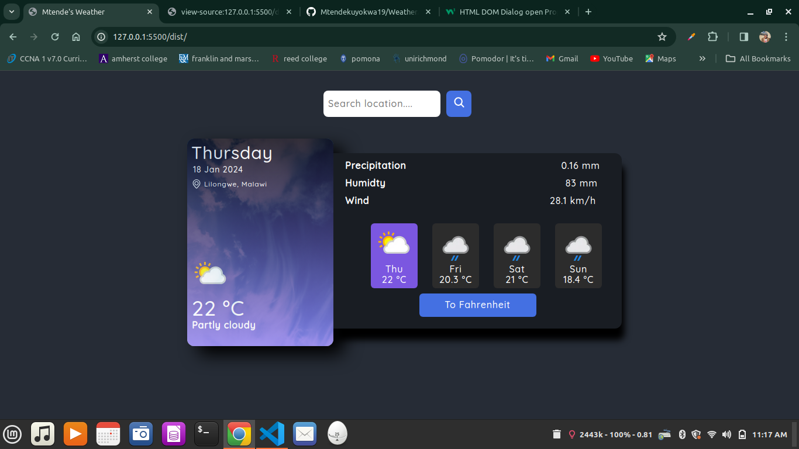

# WeatherApp

 > _Screenshot of the Web application _

## Short Description 🎲

An Application build with an API for fetching weather. It ipresents daily weather for the next days, wind speed and precipitation.It was a build to show i understand how to use APIs

## Demo 🚴

- click [Live Preview]( https://mtendekuyokwa19.github.io/WeatherApp/)to check it out!

#### Installation

1. clone the repo

- `git@github.com:Mtendekuyokwa19/WeatherApp.git`

2. Installation of all the pckages

- `npx webpack`

## Features and Aspects

1. Fetching today's weather

   > It is able to fetch todays weather i.e it's precipitation and average temperature

2. Collectiong forecast
   > gets the weather fore the next three days
3. Toogling Metric
   > One is able to switch from celcisus to fahrenheit and viceversa.

## Technologies and Tools 🔧

1.  Webpack
2.  vanilla CSS
3.  Vanilla Javascript
4.  Chrome Dev tools
5.  Git
6.  Google fonts
7.  Figma And Figma community
8.  Github Pages
9.  npm
10. Free weather API

## What I learned 🎓

- Using APIs
- Error Handling methods
- Using Promises

## Motivation 🧠

- Using APIs practice
- Creating an Air quality management sys
  > to battle Air pollution

## Credits 🤝

- [Google Fonts](https://fonts.google.com/specimen/Quicksand?query=Quicksand).

- [Figma Color palettes](<https://www.figma.com/file/kVuVeHcwCENaBn4kKAxhGt/Dashboard---Dark-And-Light-Modes-%7C-Color-Variables-(Community)?type=design&node-id=7-1619&mode=design&t=ng4IU85pFsnxovSB-0>)

## Future Update🔮

1. Charts and dates
2. Air Quality forecasting
3. seasonal forecasting
